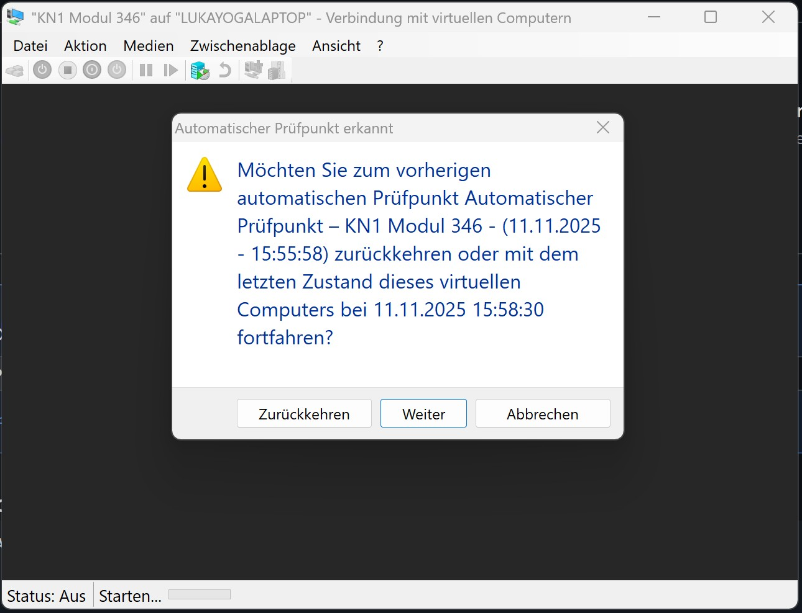

# KN1

## A) Hypervisor Typ 1 und 2 
Hypervisoren vom Typ 1 und Typ 2 sind Software, mit der man eine oder mehrere virtuelle Maschinen (VMs) auf einer einzelnen physischen Maschine ausführen kann. Hypervisoren verwaltet und weist den VMs physische Ressourcen zu und kommuniziert im Hintergrund mit der zugrunde liegenden Hardware. 

Der Hypervisor vom Typ 1 sitzt auf dem Bare Metal Server und hat direkten Zugriff auf die Hardware-Ressourcen.
Im Gegensatz dazu ist der Typ-2-Hypervisor eine Anwendung, die auf dem Host-Betriebssystem installiert ist. 

## B) Virtualisierungssoftware
Virtualisierungssoftware: Hyper-V-Manager

### Hyper Visor Typ Vermutung
Ich vermute, dass es Hypervisions Type 1 ist, da ich Resourcen wie RAM und Festplaten Speicher zuweisen kann.

### Test

#### Schrit 1
Host-System RAM: 64 GB
Host-System CPU: 14 Kerne, 20 Logische Prozessoren

#### Schrit 3
Ich habe in den Einstellungen der VM 1024 Logische Prozessoren zugeschrieben und bekam diesen Errorcode beim starten:

#### Schrit 4
Ich habe in den Einstellungen der VM 65000 MB RAM zugeschrieben und bekam diesen Errorcode beim starten:

### Endresultat
Hyper-V-Manager ist ein Hypervisor Typ 1, weil ich in den Einstellungen der Hardware Resourcen nicht das Limit von meinem Host-System überschreiten darf.
