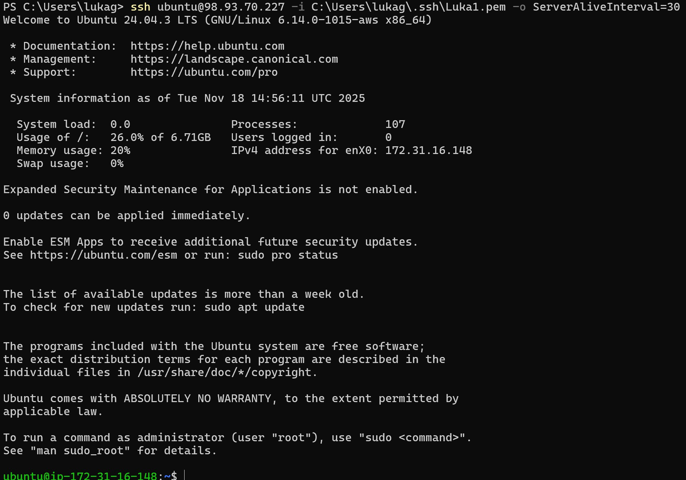

# KN2

## B) Instanz erstellen

Einstellungen:
- Diskgrösse: 8 GB
- Betriebssystem: Linux/UNIX
- Grösse des RAM: 1 GB
- Anzahl der CPUs: 1 

## C) Zugriff mit SSH-Key
Trying to connect with the right private key

Trying to connect with the wrong private key

Der Verwendete Schlüssel in der Instanz

