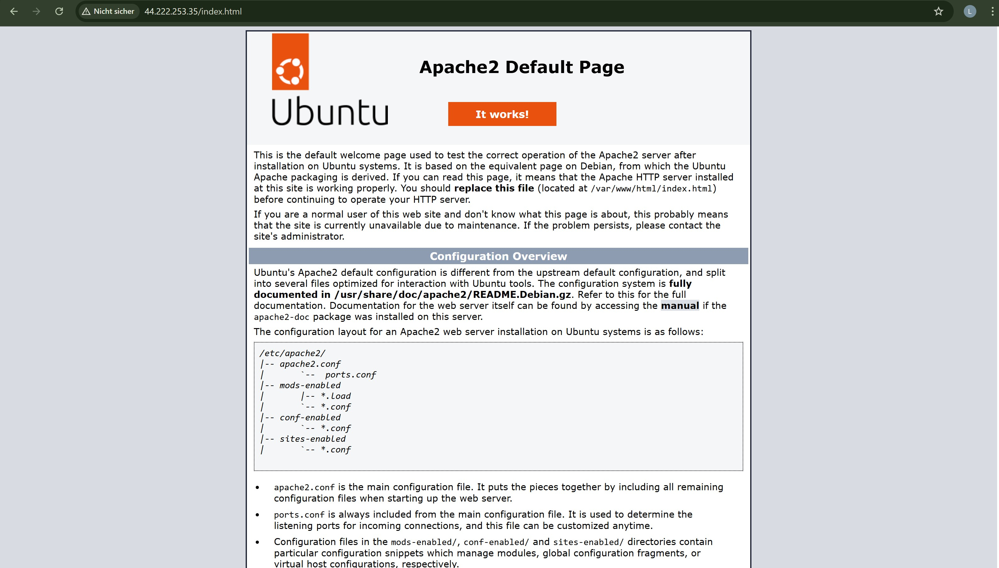
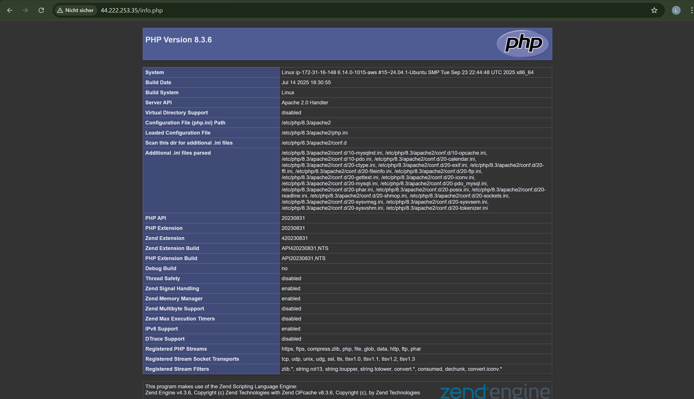
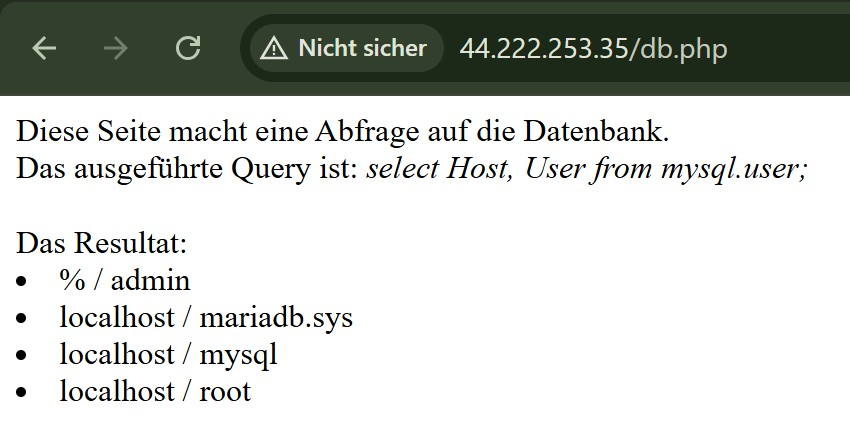
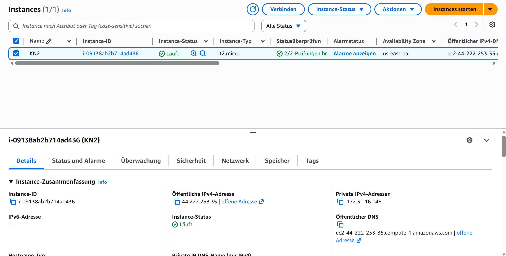
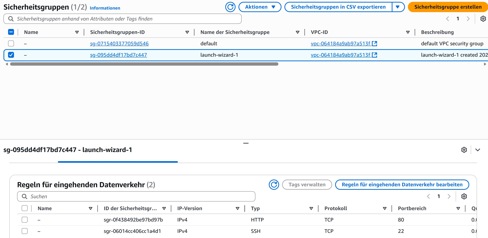
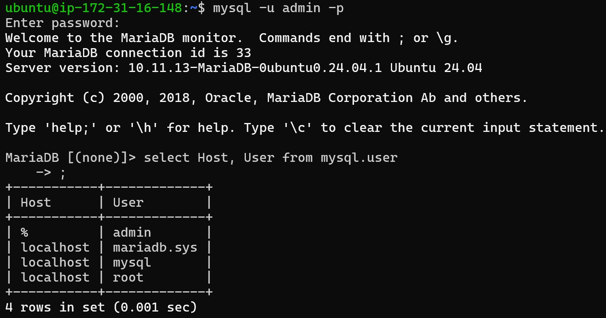

# KN3

## 1. Erstellen Sie Screenshots der funktionierenden Webseiten (mit sichtbarer URL).




## 2. Screenshot der Details der Instanz mit sichtbarer öffentlichen IP.


## 3. Screenshot der Regeln der Sicherheitsgruppe


## 4. Screenshot des Befehls zum einloggen in die mysql Konsole und das entsprechende Resultat der Abfrage.


## 5. Kurze Erklärung was Ihre SQL-Abfrage (SELECT-Statement) ausliest.
```sql
SELECT Host, User FROM mysql.user
```
Dieses SELECT-Statment ist ein JOIN SELECT statment, welches alle User aufzeigt und mit welchen Hosts(IP-Adressen) sie sich verbinden dürfen.
